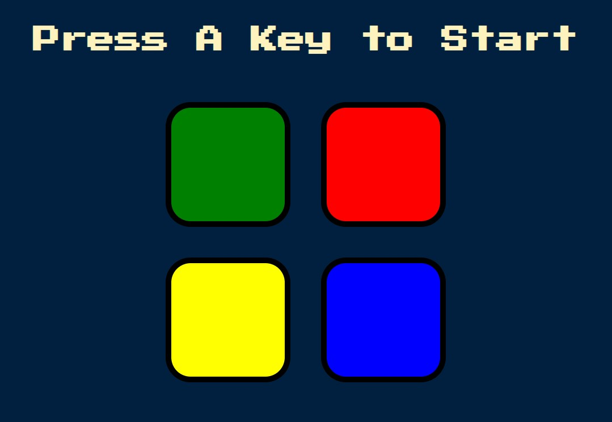

<!-- PROJECT -->

<a id="readme-top"></a>

<div align="center">
  

  <h3 align="center">Simon Game</h3>

  <p align="center">
    The Simon Game to practise JavaScript!
  </p>
</div>

<!-- TABLE OF CONTENTS -->
<details>
  <summary>Table of Contents</summary>
  <ol>
    <li>
      <a href="#about-the-project">About The Project</a>
      <ul>
        <li><a href="#built-with">Built With</a></li>
        <li><a href="#key-feature">Key Feature</a></li>
      </ul>
    </li>
    <li>
      <a href="#getting-started">Getting Started</a>
    </li>
    <li><a href="#contact">Contacts</a></li>
  </ol>
</details>

<!-- ABOUT THE PROJECT -->

## About The Project

Simon Game is a memory challenge where you repeat a sequence of colors and sounds. The game shows you a pattern, and you have to mimic it by pressing the corresponding buttons. The sequence gets longer and more complex as you progress. Test your memory and see how far you can go!

### Built With

<div display="flex">
  
	
	
 	
     	
</div>

### Key Feature

The `game.js` file contains the JavaScript code for the Simon Game, a memory challenge where users repeat a sequence of colors and sounds. The game is built using HTML, CSS, and JavaScript with jQuery.

#### Variables

- `userClickedPattern`: An array to store the colors clicked by the user.

- `buttonColours`: An array containing the available colors for the game.

- `gamePattern`: An array to store the sequence of colors generated by the game.
- `levelTitle`: A jQuery object representing the level title element.
- `started`: A boolean flag to indicate whether the game has started.

- `level`: An integer representing the current level of the game.

#### Event Listeners

- `keydown`: An event listener that starts the game when any key is pressed.

- `click`: An event listener that handles user input by adding the clicked color to the `userClickedPattern` array and playing the corresponding sound and animation.

#### Functions

- `checkAnswer(currentLevel)`: A function that compares the user's input with the game's pattern. If the answer is correct, it checks if the user has completed the current level. If so, it starts the next level. Otherwise, it calls the `gameOver()` function.

- `checkAnswer(currentLevel)`: A function that compares the user's input with the game's pattern. If the answer is correct, it checks if the user has completed the current level. If so, it starts the next level. Otherwise, it calls the `gameOver()` function.
- `nextSequence()`: A function that generates the next color in the game's pattern, updates the level title, and plays the corresponding sound and animation.
- `animatePress(currentColour)`: A function that adds a "pressed" class to the clicked button for a short duration, creating a visual feedback.
- `animateNext(currentColour)`: A function that animates the next color in the game's pattern by fading in and out.
- `playSound(currentColour)`: A function that plays the sound associated with the given color.
- `gameOver()`: A function that displays a "Game Over" message, plays the "wrong" sound, and adds a "game-over" class to the body element for visual feedback.
- `startOver()`: A function that resets the game variables to their initial values.

<p align="right">(<a href="#readme-top">back to top</a>)</p>

<!-- GETTING STARTED -->

## Getting Started

To get a local copy up and running follow these simple example steps.

1. Clone the repo
   ```sh
   git clone https://github.com/majinbrum/simon-game.git
   ```
2. Open the `index.html` file and play the demo!

- The game starts when any key is pressed.
- The user's input is compared with the game's pattern in real-time.
- The game progresses to the next level when the user correctly repeats the entire pattern.
- The game ends when the user makes a mistake.
- The game can be restarted by pressing any key after the "Game Over" message is displayed.

<p align="right">(<a href="#readme-top">back to top</a>)</p>

<!-- CONTACTS -->

## Contacts

Bruna Alamia - [@linkedin](https://linkedin.com/in/brunaalamia) - brunaalamia@gmail.com

<p align="right">(<a href="#readme-top">back to top</a>)</p>
